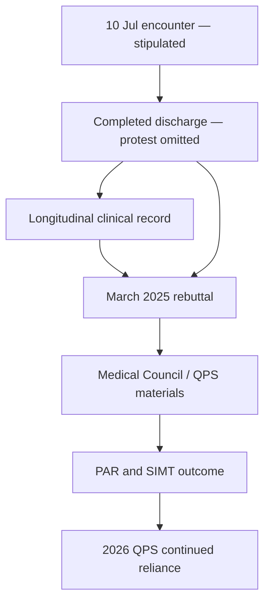

# RESTORED FOOT-PROTEST DEPENDENCY AUDIT

## How much of the clinical and institutional narrative depended on omission of the patient’s contemporaneous objection that his feet had not been adequately examined or addressed before discharge?

**Repository:** `TitanicParker/for-counsel`

**Repository state examined:** branch `agent/complete-evidential-corpus` at commit `a73bb8d3c54616f740c78642e3c3957ad9f836e9`, generated and verified against parent `main` commit `576100898c26d65b2827cbbc401a277151a9acf9`; merged into `main` by commit `f8531bc797dfa2cda17d29e183bee883b636ac58`

**Corpus examined:** `sources/consolidated/evidence-corpus.md`, generated from the 47 registered public/patient-source representations in `sources/manifest/source-manifest.csv`

**Date:** 13 August 2026

**Status:** SUPPORTING — documentary dependency analysis / stipulated-premise analysis / not primary evidence
**Limits:** not a clinical-standard, negligence, dishonesty, conscious-omission, reckless-reliance, knowing-reconstruction, concealment, causation, admissibility or fraud determination; each such category remains distinct and separately evidenced

> **Methodological premise.** This report assesses dependency on the instructed factual premise that the incident occurred as described. It is a stipulated fact for this audit and is supported by patient-origin evidence in the Patient Statement Log at [`PSL-GEN-0197`](../../sources/consolidated/evidence-corpus.md#L8811-L8812) and [`PSL-GEN-0242`](../../sources/consolidated/evidence-corpus.md#L8898-L8899). It is not yet independently corroborated by a native institutional record or witness statement. Repetition within the Patient Statement Log or later analysis is not counted as independent corroboration.

> **Essential boundary.** Liam did not mention levodopa during the protest. The incident was an urgent objection that his feet had not been adequately examined or addressed before discharge and a rejection of patient-accessed Podiatry as an adequate answer to that immediate concern. It was not a demand for levodopa, an objection to the levodopa-deferral policy, a medication dispute, or proof that Liam understood any relationship between foot allocation and dopaminergic treatment.

## Executive answer to the governing question

No—not safely in substantially the same terms concerning the completeness of the admission, the patient’s participation, the acceptance of the foot allocation, the clinician’s awareness of dissatisfaction, or the apparent closure of the discharge process.

The objective and clinical substrate largely survives: the examination findings, structural foot abnormalities, dystonic-looking gait, Parkinsonism diagnosis, imaging, prescriptions, genuine uncertainty, clinical opinions as opinions, and the fact that Podiatry was arranged. What does not survive unqualified is the completed record’s ability to operate as a complete or neutral account of the patient’s position and of how the unresolved feet were handled.

On the stipulated premise, restoring the protest changes the historical dataset in five material ways. First, the unresolved relationship recorded as `Not clear` was not merely a clinician-recognised uncertainty; it was also the subject of an urgent patient objection before discharge. Second, Podiatry was operative but not accepted by Liam as an adequate answer to the problem he believed remained unexamined. Third, Monaghan personally heard that objection, so an account premised on no awareness of the 2017 foot-related dissatisfaction is unavailable within this stipulated analysis. Fourth, the finished narrative omitted both sides of a material exchange while presenting a lengthy, apparently comprehensive account designed to consolidate discussions and provide a “clear plan.” Fifth, later readers who received only the completed record could mistake an unresolved and contested allocation for an orderly, accepted and clinically complete disposition.

The protest does not prove that Podiatry was clinically inappropriate, that a further neurological examination was required, that discharge was unsafe, that every foot symptom was neurological, or that levodopa should have been prescribed. It does not directly falsify the narrow sentence that Liam had a `good understanding` of why dopaminergic treatment was being delayed. It prevents that medication-specific sentence from safely being enlarged into a certificate of agreement with the whole architecture, satisfaction with the admission, acceptance of Podiatry, or absence of dissent.

The strongest dependency finding is therefore targeted:

> **The apparent consensual completeness of the 2017 foot/Podiatry disposition depended materially on omission of the protest. The clinical facts and the existence of the disposition survive; its appearance as accepted, sufficient, uncontested and fully communicated does not. Later clinician and institutional accounts remain usable for what those actors said or decided, but any conclusion concerning patient position, absence of contemporaneous objection, adequacy of foot integration or legitimacy of relying on the discharge as a complete decision-process record must be independently reconstructed.**

## 1. Sources, hierarchy and analytical discipline

Primary records control. Repository analyses—including the existing counterfactual protest audit—were used only to identify propositions and falsifiers. They were not treated as evidence. The current source manifest, proposition matrix, knowledge chronology and controlled glossary were used as quality controls.

Load-bearing sources are:

| Source / EUID anchor | Evidential role | Stable 47-source corpus citation | Original representation (secondary provenance) | Principal limitation |
|---|---|---|---|---|
| `GP17REF` / `GP17REF-20170629-0063`–`0120` | Integrated presenting foot, gait, tone, toe-clawing, dexterity and work problem | [Corpus L76–L188](../../sources/consolidated/evidence-corpus.md#L76-L188) | [GP referral](../../docs/source-records/gp-referral.html) | Redacted/OCR representation; native custody and full verification remain outstanding |
| `DS17` / `DS17-GEN-0313`–`0401` | Dystonic-looking foot-drop-like gait, structural findings and Parkinsonism impression | [Corpus L5259–L5416](../../sources/consolidated/evidence-corpus.md#L5259-L5416) | [Discharge representation](../../docs/source-records/discharge-summary.html) | Composite redacted representation; not a unitary 11 July snapshot |
| `DS17` / `DS17-GEN-0393`–`0459`, `0534`–`0535` | `Not clear`, Complex Case Meeting, treatment deferral and Podiatry disposition | [Corpus L5394–L5506](../../sources/consolidated/evidence-corpus.md#L5394-L5506), [L5652–L5656](../../sources/consolidated/evidence-corpus.md#L5652-L5656) | [Discharge representation](../../docs/source-records/discharge-summary.html) | Native drafts, authorship/audit trail and exact physical-discharge state remain outstanding |
| `DS17` / `DS17-GEN-0870`–`0924` | Stated documentary purposes: consolidate discussions, provide a clear plan and firmer footing | [Corpus L6198–L6304](../../sources/consolidated/evidence-corpus.md#L6198-L6304) | [Discharge representation](../../docs/source-records/discharge-summary.html) | Clinician-authored account of communication and documentary purpose |
| `DS17` / `DS17-GEN-1142`–`1159` | `good understanding` of dopaminergic delay `at least for now` | [Corpus L6750–L6790](../../sources/consolidated/evidence-corpus.md#L6750-L6790) | [Discharge representation](../../docs/source-records/discharge-summary.html) | Narrow medication-specific assessment; not evidence of agreement with foot disposition, discharge satisfaction or absence of dissent |
| `GP17POD` / `GP17POD-20170706-0001`–`0024` | GP phoned Podiatry; priority `as Parkinson's` | [Corpus L213–L259](../../sources/consolidated/evidence-corpus.md#L213-L259) | [GP Podiatry note](../../docs/source-records/gp-podiatry-2017-07-06.md) | Does not establish referral content, ownership, treatment or feedback |
| `N18` / `N18-20180424-0034`–`0040` | Recorded Procyclidine withdrawal/restoration and foot/broader-state change | [Corpus L805–L824](../../sources/consolidated/evidence-corpus.md#L805-L824) | [2018 notes](../../docs/source-records/neurology-notes-2018.html) | Patient-reported treatment-state change does not prove one mechanism |
| `N20` / `N20-20201008-0035`–`0039` | Foot throw recorded as `actually parkinsonian` with normal power | [Corpus L1880–L1893](../../sources/consolidated/evidence-corpus.md#L1880-L1893) | [2020 notes](../../docs/source-records/neurology-notes-2020.html) | Clinical opinion proves the recorded opinion, not every historical foot cause |
| `N21`, `N22`, `N23` | Sinemet commencement; morning foot pattern; OFF/dystonia, Stalevo and `misalignment` material | [N21 L2014–L2057](../../sources/consolidated/evidence-corpus.md#L2014-L2057), [N22 L7189–L7217](../../sources/consolidated/evidence-corpus.md#L7189-L7217), [N23 L7311–L7779](../../sources/consolidated/evidence-corpus.md#L7311-L7779) | [2021](../../docs/source-records/neurology-notes-2021.html), [2022](../../docs/source-records/neurology-notes-2022.html), [2023](../../docs/source-records/neurology-notes-2023.html) | Mixed mechanisms and qualifying material persist; standards require expert evidence |
| `N25` / `N25-GEN-0019`–`0040` | Overnight/first-step history, Sinemet relief and CR decision | [Corpus L8323–L8387](../../sources/consolidated/evidence-corpus.md#L8323-L8387) | [2025 notes](../../docs/source-records/neurology-notes-2025.html) | Does not prove exclusive cause or earlier required treatment |
| `REB25` | March 2025 `did not understand`, framing, `good understanding` and profound-relief account | [Corpus L2308–L2597](../../sources/consolidated/evidence-corpus.md#L2308-L2597) | [Clinician response](../../docs/source-records/official-rebuttal.html) | Primary for assertions in 2025; derivative for 2017 history |
| `MCMON25` / `MCMON25-20250729-0088`–`0164` | July 2025 Medical Council account | [Corpus L3540–L3655](../../sources/consolidated/evidence-corpus.md#L3540-L3655) | [Medical Council response](../../docs/source-records/medical-council-monaghan-response-2025-07-29.md) | Regulatory-purpose retrospective submission |
| `COUN25` / `COUN25-20250507-0012`–`0020` | Counihan's later involvement statement | [Corpus L2741–L2754](../../sources/consolidated/evidence-corpus.md#L2741-L2754) | [Counihan response](../../docs/source-records/counihan-response-2025-05-07.md) | Does not independently prove exact 2017 consultative role |
| `SIMT250903` / `SIMT250903-20250903-0012`–`0029` | PAR/SIMT outcome and stated rationale | [Corpus L4242–L4273](../../sources/consolidated/evidence-corpus.md#L4242-L4273) | [SIMT outcome](../../docs/source-records/simt-outcome-2025-09-03.md) | Full PAR, evidence matrix, source schedule and minutes unavailable |
| `QPS260126` / `QPS260126-20260126-0012`–`0029` | Continued institutional reliance | [Corpus L4549–L4577](../../sources/consolidated/evidence-corpus.md#L4549-L4577) | [QPS response](../../docs/source-records/qps-response-2026-01-26.md) | New governance act, not independent proof of the 2017 patient position |

`STIP-10JUL17` denotes the instructed premise. The report cites, rather than reproduces, the Patient Statement Log: [`PSL-GEN-0197`](../../sources/consolidated/evidence-corpus.md#L8811-L8812) and [`PSL-GEN-0242`](../../sources/consolidated/evidence-corpus.md#L8898-L8899). Those patient-origin entries support the stipulated account but are not independent-origin corroboration.

## 2. The protest’s minimum meaning

On the instructed premise, the incident establishes these minimum propositions:

1. On 10 July 2017, the day before expected discharge, Liam believed that his feet had not been adequately examined or addressed.
2. He considered the concern serious enough to use the first available group of four new medical students to summon the treating neurologist urgently.
3. His `full NCT`/`bald tyres` analogy communicated a perceived mismatch: an extensive hospital assessment was being treated as complete while an essential functional problem remained unresolved.
4. Monaghan personally heard the objection. For him, lack of awareness that Liam objected to the adequacy of the foot handling before discharge is unavailable.
5. The natural meaning of Monaghan’s response—`It’s as easy for you to get a Podiatry appointment as it is for me`—was that obtaining Podiatry was an answer Liam could pursue and that the neurologist was not undertaking, in that exchange, to secure a different or additional neurological resolution before discharge.
6. The response placed at least practical responsibility for obtaining the proposed foot service back on Liam. It did not explain whether Podiatry was an adjunct within Neurology-owned integration or the terminal destination for the unresolved problem.
7. No further examination or resolution is visible in the presently available record; nor is an integrated causal decision, named synthesis owner or reopening rule visible.
8. The completed discharge narrative omitted Liam’s request, the students’ role and presence, his protest, Monaghan’s response and the fact that discharge proceeded afterward.

The incident does **not** establish:

- that Liam’s clinical interpretation was correct;
- that the feet had received no examination at all—the discharge records gait and structural findings;
- that Monaghan accepted a neurological cause for all foot symptoms;
- that Podiatry was medically inappropriate;
- that discharge was clinically unsafe or below standard;
- that Liam mentioned, requested or understood levodopa;
- that Monaghan intended to abandon the feet or mislead anyone;
- that no further unrecorded examination, discussion or reconsideration occurred;
- that the four students understood the clinical significance of the exchange;
- that the omission was deliberate.

The minimum finding is therefore an **unresolved, directly communicated disagreement about adequacy and ownership**, not proof of a particular mechanism or remedy.

## 3. The shortest neutral record that should have existed

A record capable of preserving the event without adopting Liam’s causal interpretation as clinical truth could have stated:

> **10 July 2017, pre-discharge:** Patient asked medical students to request urgent review by the treating neurologist. He stated, using a `full NCT`/`bald tyres` analogy, that he did not consider his feet adequately examined or addressed and remained concerned about discharge. The clinician advised that obtaining a Podiatry appointment was as accessible to the patient as to the clinician. The foot findings and their relationship to the neurological presentation remain `Not clear`; structural foot care is to proceed through Podiatry. No further examination or resolution is visible in the presently available record following this exchange. Patient’s concern remained unresolved in the discussion, and discharge proceeded as planned the following day.

If a further examination, discussion, satisfaction statement, integrated ownership decision or different discharge decision occurred, it should have been added. The entry does not say Liam was medically right, does not accuse the clinician, and does not connect the protest to levodopa.

## 4. Effect on the completed discharge narrative

### 4.1 `Not clear`

`Not clear` survives as an accurate expression of clinician uncertainty. Restoring the protest makes that uncertainty more consequential. It was not merely a differential left open in the document; it was an uncertainty the patient expressly identified as an unresolved defect in the planned discharge. The phrase therefore changes from a passive diagnostic qualifier to the context of a known, contested transition.

### 4.2 Podiatry

The clinical legitimacy of Podiatry for pes planus, hammertoes, corns and calluses survives. The fact that a referral was sent survives. The appearance that Podiatry was an accepted or self-evidently sufficient resolution does not. On the stipulated premise, the restored exchange supports the narrower finding that, at the point of objection, the operative answer communicated was patient-accessed Podiatry; no different neurological synthesis or defined integrated plan is visible in the presently available record.

The GP note that Podiatry would prioritise the case `as Parkinson's` is important contrary evidence: it suggests at least some intended linkage rather than a pure peripheral silo. But it does not identify what Podiatry was asked to determine, who retained ownership of causal integration, what information returned, or whether Liam’s objection was communicated.

### 4.3 Apparent completeness

The discharge document describes itself as consolidating discussions, providing a `clear plan`, exploiting a long admission to obtain a `firmer footing`, and recording that Liam asked many appropriate questions. Those statements increase rather than reduce the materiality of the omitted exchange. A reasonable reader could infer that the lengthy document captured the material patient concerns and closure discussions. Restoring the protest shows that it did not capture a direct challenge at the central foot/discharge hinge.

This does not make the document clinically empty or globally false. It makes it materially incomplete as a decision-process and patient-position narrative.

### 4.4 Participation and understanding

The record shows that Liam received extensive information and questioned appropriately. Those facts survive. What changes is the nature of participation. Restored history shows participation included dissent and an urgent request for further attention—not simply learning, questioning and carrying forward the plan.

### 4.5 Transmission to the GP and later clinicians

Version A transmitted objective findings, a broad differential, `Not clear`, Podiatry and a detailed staged plan. It did not transmit that Liam rejected the immediate foot handling as inadequate. A GP or later clinician could therefore interpret recurring foot complaints as later local developments within an accepted mixed model. Version B would alert the reader that the allocation was disputed at origin and would make later foot evidence a possible return of an unresolved foundational problem.

### 4.6 Ownership and reopening

The completed record identifies no named owner for integrating Podiatry findings with dystonic-looking gait, no synthesis plan, and no event that would reopen the relationship. The protest is itself a practical reopening signal: `the problem central to my admission remains inadequately addressed before discharge`. The visible response did not convert that signal into a recorded criterion, test or ownership decision.

### 4.7 Legitimacy of discharge

The premise establishes that discharge proceeded despite a known unresolved objection. It does not establish that discharge was medically illegitimate. A reasonable clinician could conclude that inpatient investigation was sufficient, structural care could safely continue as an outpatient, and diagnostic uncertainty need not delay discharge. But a record capable of supporting that conclusion transparently would need to preserve the objection and the reason it did not alter discharge.

The omission therefore allowed an unresolved and contested allocation to appear orderly, uncontested and complete. It was more than an omitted interpersonal detail.

## 5. `Good understanding` kept within its proper scope

The exact discharge proposition was that Liam had a `good understanding of why we wished to delay the commencement of levodopa or dopamine agonist type treatments at least for now`. The protest did not mention those treatments. It does not directly prove the sentence false.

The sentence may accurately establish the clinician’s impression that Liam comprehended the medication rationale. Understanding can coexist with disagreement, and disagreement about foot assessment can coexist with understanding of a separate medication explanation.

After restoration, however, the sentence cannot safely establish that Liam:

- accepted the overall management architecture;
- agreed with discharge;
- accepted Podiatry as an adequate answer to the feet;
- believed the admission had addressed the presenting problem;
- raised no objection;
- participated consensually in the foot/peripheral allocation;
- accepted indefinite uncertainty without neurological ownership or a reopening mechanism.

The March 2025 rebuttal reproduced `good understanding` inside a broader defence that the matter had been `very clearly framed` and that the clinician had communicated appropriately. That is a scope enlargement risk. The narrow medication proposition may survive unchanged; its use as general proof of communication, participation or acceptance becomes materially incomplete and potentially misleading by omission unless the stipulated protest is disclosed and distinguished.

## 6. Two historical records

| Domain | Version A — completed record | Version B — protest restored | Material change |
|---|---|---|---|
| Presenting problem | Integrated gait, tone, dexterity and poor feet, followed by extensive neurological assessment | Same, plus patient says the central foot problem remains inadequately addressed | Completeness is disputed from within the admission, not only retrospectively |
| Foot examination | Dystonic-looking gait and structural feet recorded | Same objective examination, but patient expressly regards it as inadequate to answer the foot problem | Objective findings survive; sufficiency no longer presumed |
| Causal relationship | `Not clear`; separate/peripheral possibilities | `Not clear` plus known patient challenge to discharge on that unresolved basis | Uncertainty becomes a contested governance/ownership problem |
| Podiatry | Sensible operative referral for structural feet | Referral remains sensible as possible adjunct, but Liam rejects it as an adequate immediate answer; clinician directs access back to him | Acceptance and sufficiency are defeated; clinical appropriateness remains open |
| Patient position | Questions, learning, insight and medication-specific `good understanding` | Questions and understanding coexist with urgent dissent about the feet | Agreement, satisfaction and absence of objection cannot be inferred |
| Clinician knowledge | Clinician knew feet were structurally abnormal and causally unresolved | Clinician also knew Liam believed they had not been adequately examined or addressed | Lack of awareness of 2017 dissatisfaction unavailable to Monaghan |
| Discharge process | Long admission produced firmer footing and clear staged plan | Discharge proceeded after a material objection with no visible resolution or recorded rationale for overriding it | Apparent consensual closure materially weakened |
| GP/future-reader impression | Detailed, thoughtful, comprehensive plan with Podiatry and follow-up | Detailed clinical plan built on a disclosed, unresolved dispute about the presenting problem | Reader would be more likely to monitor ownership and reopen the relationship |
| Later foot events | New local findings or complications within mixed pathology | Possible returns of a problem expressly identified as unresolved before discharge | Historical force increases; mechanism remains open |
| Complaint review | Retrospective patient dissatisfaction may appear newly articulated | A core dissatisfaction was directly communicated in 2017 and omitted | Later reviewer must reconstruct patient position independently |

## 7. Dependency matrix

| Proposition or later reliance | Source and exact wording | Apparent meaning without protest | Meaning after protest is restored | Dependency classification | Materiality | Strongest innocent explanation | Further evidence required |
|---|---|---|---|---|---|---|---|
| Adequacy of the admission | `DS17`: long admission allowed much to be done and gave a `firmer footing` | Thorough admission adequately resolved what required inpatient attention | Considerable work occurred, but Liam directly disputed adequacy concerning the feet before discharge | **Materially weakened** | High for completeness; clinical adequacy remains expert-dependent | Inpatient neurological work was extensive and outpatient structural care was reasonable | Post-protest notes, ward round, discharge rationale, expert opinion |
| Completeness of foot assessment | `DS17`: dystonic-looking gait, pes planus, hammertoes; `STIP-10JUL17` | Feet were examined sufficiently to identify neurological appearance and structural pathology | Examination occurred, but its sufficiency was contemporaneously challenged and no response examination is visible | **Materially incomplete on the stipulated premise** if described as complete | High | Clinician reasonably regarded existing examination as sufficient | Examination video, bedside/ward notes, student and clinician evidence |
| `Not clear` | `DS17`: relationship `Not clear` | Honest unresolved differential | Same, but known to be unacceptable to Liam as the endpoint of discharge | **Survives with qualification** | High for governance meaning, low for literal truth | Diagnostic uncertainty was legitimate and did not require inpatient resolution | Expert view; any documented discussion/reconsideration |
| Podiatry disposition | `DS17`: please refer to Podiatry; `GP17POD`: priority `as Parkinson's`; `STIP-10JUL17` response | Appropriate, organised structural-foot pathway, potentially integrated | Operative pathway survives; acceptance and sufficiency do not. Response suggests patient-accessed Podiatry was the immediate practical answer | **Historically dependent on the omission** for appearance of consensual sufficiency | Very high | Podiatry was intended as a safe adjunct and GP linkage `as Parkinson's` supplied integration | Original referral, Podiatry file, feedback, ownership plan |
| Patient participation | `DS17`: many questions, debriefing, clear plan | Active, informed participation consistent with closure | Participation included urgent dissent that the document omitted | **Materially incomplete on the stipulated premise** if presented only as assent-like participation | High | Document described education, not agreement, and did not purport to list every exchange | Drafts; witness accounts; patient-facing communications |
| `good understanding` | `DS17` | Understanding may be read as broader acceptance | Remains possible regarding medication delay only; cannot prove acceptance of feet/Podiatry/discharge | **Survives unchanged narrowly; materially weakened if enlarged** | Very high where reused broadly | Separate subjects: medication comprehension and foot dissatisfaction can coexist | Evidence of exact counselling, teach-back, later use by reviewers |
| Clear communication | `REB25`: `everything has been very clearly framed` and gentle communication | Strategy and causal context were openly and adequately communicated | Cannot safely imply that the contested foot allocation and dissatisfaction were preserved or resolved | **Materially weakened** | High | Clinician meant Parkinson’s diagnosis and medication risks, not every discharge disagreement | Full rebuttal context, drafts, testimony, patient communications |
| Clinician did not understand how Liam felt | `REB25`: `I did not understand that this was how he felt` | Clinician first learned in 2025 of the relevant dissatisfaction | He knew in 2017 that Liam felt his feet had not been adequately addressed; he may still not have understood later pain magnitude, duration or causal theory | **Inconsistent with the stipulated premise if read broadly; survives with qualification if read narrowly** | Very high | `this` referred to the severity and accumulated suffering described in 2025, not the 2017 objection | Drafts, questioning on intended referent, complaint documents possessed |
| Strategy openly and adequately framed | `REB25`; `MCMON25`: carefully explained/explored why Sinemet would be deferred | Open, complete explanation of governing strategy | Medication rationale may have been openly explained; disputed foot ownership and dissatisfaction were not transparently preserved | **Survives with qualification** | High | Later statements were medication-specific and never intended to certify the foot allocation | Exact pleadings/context; evidence of foot-specific discussions |
| Complaint rebuttal | `REB25` as a whole | Retrospective explanation can rely on complete historical chart | Must be re-read against Monaghan’s personal knowledge of an omitted 2017 objection | **Materially weakened** in patient-position and communication domains | Very high | Good-faith compression, sincere mixed model, focus on 2025 complaint wording | Drafting trail, full working file, instructions, author examination |
| Medical Council submission | `MCMON25`: explanation, second opinion, very good relationship | Patient was well informed; dispute is later disagreement over treatment | Relationship may have been good, but there was an omitted material 2017 dissent about foot adequacy | **Survives with qualification; historically dependent where it implies no earlier dispute** | High | Submission answered levodopa allegations, not a then-unknown stipulated protest issue | Complaint supplied to Council, annexes, drafts, Council questions |
| Counihan-related accounts | `COUN25`: not involved in care; `MCMON25`: limited case-meeting advice | Scope of Counihan’s role bears on authority for treatment caution | Protest does not itself prove Counihan’s involvement or knowledge; it matters only if his authority is used to validate overall architecture | **Survives largely unchanged** | Low-to-moderate | Separate issue concerning consultative versus direct-care role | Meeting records, Counihan testimony, referral materials |
| Peripheral/neuropathic descriptions | `DS17`, `REB25` | Reasonable evolving causal explanation within mixed pathology | Clinical hypothesis survives, but cannot imply patient accepted allocation or that original concern was resolved | **Survives with qualification** | Moderate-to-high | Structural disease, burning pain and pregabalin benefit supported mixed/peripheral reasoning | Podiatry/pain expert evidence, complete trajectory, native records |
| PAR/SIMT no-deficit conclusion | `SIMT250903`: risks and alternatives considered; Sinemet started in 2021; `no deficit` | Independent multidisciplinary validation of care | Validity depends on whether reviewers knew and tested the protest and foot-integration issue; available outcome does not show that they did | **Unable to determine; potentially inherited dependency** | Very high | Full PAR may independently analyse patient position and foot allocation | Full PAR, evidence matrix, minutes, source schedule, interviews |
| QPS refusal to reopen | `QPS260126`: reviews used contemporaneous information and remain appropriate | Prior review remains sound despite later diagnosis | The stipulated protest concerns a contemporaneous event omitted from the visible record; unqualified reliance requires evidence it was considered | **Materially weakened unless independently considered** | Very high | QPS may have possessed patient accounts or a full PAR addressing the issue | QPS file, search terms, source pack, deliberative record |
| Institutional repetition | Later decisions repeat clinician/record history | Multiple official accounts may appear corroborative | Repetition from the same incomplete discharge/clinician lineage adds authority, not independent origin | **Historically dependent on omission where source independence is absent** | High | Reviewers may have had independent evidence not disclosed in outcomes | Source genealogy, reviewer interviews, PAR and exhibits |
| No deficit in care | `SIMT250903` | Broad institutional finding of appropriate care | Not inconsistent with the stipulated protest as a clinical conclusion, but cannot be safely supported on patient position by a process that treated the chart as complete without independent reconstruction | **Unable to determine** | Very high | Even with protest, experts/reviewers may reasonably find discharge and care appropriate | Full independent expert analysis and governance record |

## 8. Operational-partition hypothesis

The incident materially strengthens the operational-partition hypothesis while preserving mixed possibilities.

### Legitimate adjunct

Podiatry was plainly capable of treating real structural pathology. The GP’s effort to prioritise the case `as Parkinson's` supports an intended connection. On an innocent reading, Monaghan’s answer meant that outpatient Podiatry access was straightforward and that further inpatient neurological investigation was unnecessary.

### Practical allocation of structural care

This is strongly supported. The discharge asked the GP to refer, the SHO had tried in hospital, and the foot deformities were real. Nothing in the protest defeats that allocation for structural components.

### Substitute for neurological integration

On the stipulated premise, the exchange supports practical substitution **at the point of challenge**, though not necessarily throughout care. When Liam said the feet remained inadequately addressed, the visible answer was access to Podiatry. No neurological integration response, ownership statement or reconsideration is recorded. The natural meaning is not that Monaghan expressly denied neurological involvement; it is that the practical resolution offered for the unresolved concern was Podiatry.

### Discharging the unresolved problem back to the patient

The wording `as easy for you ... as it is for me` places practical procurement responsibility on Liam. Describing this as “abandonment” would overstate it because the GP and SHO were already involved in referral efforts. The safer finding is that the response framed access as something Liam could obtain rather than demonstrating that Neurology would own integration before or after discharge.

The best classification is therefore a **combination**: legitimate structural adjunct and practical allocation, functioning in the disputed exchange as a substitute for a recorded neurological synthesis and as a transfer of access responsibility back toward the patient.

## 9. Effect on later evidence

Restoring the protest does not enlarge what any later event establishes about clinical mechanism. It changes the historical question each event should trigger.

| Later event | Reading without protest | Reading with protest restored | What remains unproved |
|---|---|---|---|
| Procyclidine withdrawal/restoration, 2017–18 | Medication-sensitive foot/global phenomenon arising within follow-up | Early return of a domain Liam had already said was inadequately addressed; reason to revisit the contested allocation | Exclusive neurological cause, need for levodopa, breach |
| Parkinsonian foot throw, 2020 | Later local neurological foot finding | Direct neurological finding in the very domain known to have been contested at discharge | Retrospective identity with all 2017 pain/structural symptoms |
| Sinemet initiation, 2021 | Cautious response to undertreatment/Kemadrin constraint | Opportunity to test a historically disputed phenotype, not just commence a drug | That no unrecorded foot-centred reasoning occurred; clinical inadequacy |
| Morning foot warm-up, 2022 | Local temporal symptom information | Further possible continuity with unresolved feet and reason to define medication-state outcomes | OFF dystonia or need for CR |
| OFF dystonia, undertreatment and `misalignment`, 2023 | New mixed local complications and disagreement | Explicit modern restatement of competing explanations in a domain contested before discharge | Exclusive mechanism; professional obligation to use a specific test |
| Ordinary Sinemet relief and CR response, 2025 | Later treatment response to an evolved phenotype | Targeted response with potential historical force because the foot relationship was contested from the start | Same response would have occurred earlier; negligence or damages |
| Peripheral-pain modulation explanation | Clinically coherent mixed-mechanism account | Possible mixed explanation that must coexist with the omitted history of contested ownership; cannot supply retroactive acceptance | That peripheral cause was wrong or knowingly hardened |

These events no longer appear safely as wholly new local complications. They become **possible returns of an unresolved problem expressly identified by the patient before discharge**. That is a historical-continuity inference, not a clinical-mechanism finding.

## 10. State-of-mind analysis

State of mind must remain actor-, statement- and document-specific.

| Stage / actor | Personally known | Record possessed or controlled | Later proposition implicated | Materiality of protest | Strongest innocent explanation | Evidence distinguishing innocence, recklessness and knowledge |
|---|---|---|---|---|---|---|
| July 2017 — Monaghan | Personally heard urgent objection that feet were inadequately addressed; gave Podiatry response | Clinical record and ability to contribute to cumulative discharge account | Long admission gave firm footing; clear plan; questions consolidated; patient understood medication delay | High for patient position and foot allocation | Clinically regarded protest as an access/administrative issue, believed Podiatry sufficient, forgot it, or assumed another note would capture it | Drafts/audit trail, authorship timing, ward notes, students, clinician account, any subsequent discussion |
| March 2025 — Monaghan | Original personal knowledge plus eight years’ continuity; precise memory may have faded | Complaint, recent note, historical correspondence quoted in rebuttal | `I did not understand that this was how he felt`; everything clearly framed; `good understanding` | Very high if `this` or clear framing includes original dissatisfaction | `This` meant the later magnitude, duration or causal theory; review focused on treatment risk, not one old exchange | Drafts, full file opened, search history, legal/QPS prompts, author examination on intended referent |
| July 2025 — Monaghan | Same original knowledge; complaint/regulatory stakes; stated full disclosure posture | Large working file, complaint history, drafts and annexes | Careful explanation, very good relationship, adequate competence and care | High where statements imply absence of early dissent; lower for medication-specific explanation | Genuine good relationship can include one dispute; submission responded to levodopa allegations and may not have been asked about protest | Native submission, annexes, drafting comments, what complaint version included, regulator questions |
| May–July 2025 — Counihan / Medical Council | Counihan’s knowledge of protest not shown; regulator knowledge not shown | Unknown source set beyond visible correspondence | Scope of Counihan care/consultation and regulatory conclusions | Low for Counihan’s role; potentially high if used to validate whole architecture | Protest was irrelevant to Counihan’s actual involvement or was never supplied | Council file, Counihan records, complaint materials, interview evidence |
| Aug–Sep 2025 — PAR/SIMT | Knowledge of protest unknown | Full PAR/source pack unavailable | Decisions appropriate; no deficit in care | Potentially very high to completeness, participation and foot integration | Independent review may have considered patient evidence and still found care appropriate | PAR, matrix, minutes, interview notes, source list, student-search efforts |
| Jan 2026 — QPS | Knowledge of protest unknown; aware of governance challenge | Prior review materials unknown | Contemporaneous data support outcomes; no reopening needed | High because protest is stipulated contemporaneous data | QPS may have considered it or may have confined review to clinical standard unaffected by dissent | QPS deliberative file, evidence schedule, review scope and reasons |

### 10.1 State-of-mind ladder

1. **Ordinary clinical compression:** plausible. Discharge summaries do not record every exchange, and the subject of feet and Podiatry was not hidden.
2. **Belief the protest was administrative/access-related:** plausible. The answer itself supports the possibility that Monaghan understood the issue as obtaining structural care rather than as a challenge requiring neurological revision.
3. **Belief Podiatry adequately answered the concern:** plausible and clinically coherent because genuine structural pathology existed. The absence of a recorded explanation of adjunctive ownership limits this defence.
4. **Negligent failure to record a material objection:** properly investigable but not determinable without standards evidence and the charting context. Materiality is strong; breach is expert/legal-dependent.
5. **Conscious omission of a complicating fact:** a legitimate moderate-strength inference, not an established finding. On the stipulated premise, Monaghan personally heard the exchange when it occurred; the document’s comprehensive purpose and directional effect strengthen the inference. Inadvertence, relevance judgment, cumulative authorship and memory weaken it.
6. **Later reckless reliance:** a serious proposition-specific issue by March/July 2025 where the defence used broad language about understanding, clear framing, patient feeling or absence of earlier disagreement. It is not established merely because the record was incomplete.
7. **Later knowing use:** investigable on narrow phrases, particularly an unqualified reading of `I did not understand that this was how he felt`, if evidence shows Monaghan remembered the protest and appreciated the phrase would imply no earlier awareness. It remains unproved.
8. **Deliberate concealment:** not proved. No current source establishes an intention to suppress the incident, prevent discovery or deceive later readers.

## 11. Source genealogy and institutional reliance

The visible genealogy is:

The later stages are new acts but not necessarily new evidential origins for the 2017 patient position. The available repository does not establish that any later reviewer:

- knew the stipulated protest had occurred;
- asked Liam specifically about the bedside exchange;
- contacted or attempted to identify the students;
- obtained discharge drafts or EHR audit metadata;
- treated absence from the chart as affirmative proof of no objection;
- tested `good understanding` against a distinct foot protest;
- independently reconstructed whether Liam accepted Podiatry;
- traced later statements to sources independent of Monaghan’s record and recollection.

It also does not establish that reviewers failed to do all these things; the full PAR and source pack are absent. The correct finding is **undemonstrated independence**, not proved narrative capture.

The authority-recursion risk is substantial: a clinician-authored discharge omits dissent; later clinician explanations rely on that history; institutional reviewers rely on the clinical file and explanations; institutional outcomes then appear to validate the originating account. Only source-level disclosure can show whether independent evidence broke that loop.

## 12. Domain-specific reliability ruling

### 12.1 Material that remains reliable subject to ordinary source limitations

- objective neurological examination findings as recorded;
- the observed dystonic-looking gait and later parkinsonian foot throw;
- structural findings such as pes planus, hammertoes, corns and calluses;
- imaging and laboratory results as represented;
- prescriptions, titrations and recorded treatment events;
- recorded patient reports as proof that those reports were made;
- clinical opinions as proof of what clinicians thought at the time;
- the fact of diagnostic uncertainty;
- the fact that Podiatry, Physiotherapy and Occupational Therapy were contemplated or arranged;
- the fact that Sinemet began in 2021 and CR was prescribed in 2025;
- later institutional acts and stated conclusions as proof those acts and statements occurred.

### 12.2 Domains from which presumptive narrative reliability should be withdrawn

- completeness of the 2017 foot history and decision process;
- patient satisfaction with the admission;
- acceptance of Podiatry as sufficient;
- adequacy or consensual character of patient participation;
- absence of objection or dissent;
- Monaghan’s awareness that Liam regarded the feet as inadequately addressed;
- legitimacy of treating the foot/Podiatry allocation as uncontested;
- any broad use of `good understanding` beyond medication rationale;
- later retrospective descriptions derived from an assumption that dissatisfaction arose only in 2025;
- institutional conclusions on these domains unless their independent evidential basis is demonstrated.

Withdrawal is targeted. It requires reconstruction; it does not declare the whole chart false.

## Appendix A — Qualitative dependency heuristic (non-statistical)

This appendix replaces the draft percentage ranges. Those ranges were not statistical probabilities and lacked a reproducible numerical dataset. The assessment now uses three qualitative dimensions:

- **Dependency strength:** how much the apparent proposition relies on absence of the stipulated protest.
- **Source independence:** whether a later conclusion has a demonstrably independent evidential origin.
- **Clinical independence:** whether the underlying clinical appropriateness question can be decided without relying on patient acceptance or documentary completeness.

Ratings are assigned as follows:

- **High:** three or more identified dependency factors, no visible independent resolution, and direct contrary force from the stipulated premise.
- **Moderate:** material dependency is present but a substantial benign/independent explanation remains.
- **Low:** the proposition is primarily objective or clinically independent of the patient's acceptance.
- **Indeterminate:** missing primary process material could materially reverse the classification.

| Issue | Dependency strength | Source independence | Clinical independence | Calibration |
|---|---|---|---|---|
| Impression of consensual completeness | High | Low on current materials | Moderate | The stipulated objection is omitted from a document presenting extensive discussion and a clear plan. |
| Podiatry as accepted and sufficient | High | Low | Clinical appropriateness remains independent | Structural pathology supports Podiatry; acceptance and sufficiency do not survive restoration unqualified. |
| Narrow `good understanding` | Low within medication rationale; High if enlarged | Moderate | High | It may remain true about dopaminergic delay but cannot establish foot/discharge agreement. |
| Later clinician patient-position accounts | Moderate to High | Low to Moderate | Moderate | Meaning depends on the intended referent and the author's later recollection. |
| Institutional inheritance | Indeterminate to Moderate | Indeterminate | High | Full PAR/source pack could show independent testing. |
| Conscious omission | Indeterminate | Not applicable | Not applicable | Personal attendance supports inquiry; intent is not established. |
| Reckless later reliance | Indeterminate and proposition-specific | Not applicable | Not applicable | Requires proof of source use, recollection and risk appreciation. |
| Knowing reconstruction or deliberate concealment | Low on current materials / not proved | Not applicable | Not applicable | Requires strong actor-specific evidence absent from the current corpus. |
| Objective observations and treatment events | Low dependency | High as recorded events | High | Remain usable subject to ordinary source limitations. |
| Patient position, absence of dissent and consensual closure | High dependency | Low until independently reconstructed | Low | Presumptive narrative reliability is withdrawn only in these targeted domains. |

These are transparent forensic classifications, not measured frequencies, likelihood ratios or statistical probabilities.

## 14. Falsification

The dependency argument would be weakened, narrowed or defeated by reliable evidence that:

1. a substantive neurological foot examination occurred after the exchange and was documented or communicated;
2. the foot–neurological relationship was explicitly reconsidered before discharge;
3. the objection was recorded elsewhere and transmitted to the GP, Podiatry or later clinicians;
4. Podiatry was expressly organised as an integrated Neurology-owned adjunct with feedback and reopening rules;
5. Liam later expressed satisfaction that the objection had been resolved;
6. the natural or contemporaneously understood meaning of Monaghan’s response was an immediate undertaking to arrange integrated care rather than redirection;
7. later reviewers knew of the protest, tested it and explained why it did not alter their conclusions;
8. `good understanding` was never relied on outside its narrow medication meaning;
9. the March 2025 `did not understand` statement demonstrably referred only to the later magnitude or causal interpretation of suffering;
10. the PAR/SIMT decision rested on independent expert evidence that rendered patient acceptance and the omitted exchange immaterial;
11. drafts or metadata show the event was omitted through an innocent document-production process rather than a relevance judgment;
12. expert evidence establishes that no competent decision about discharge, integration or later care would have changed had the protest been recorded.

Conversely, contemporaneous student accounts, a draft containing then deleting the event, internal discussion of whether to record it, reliable evidence that later reviewers were not told, or explicit use of `good understanding` to infer absence of objection would materially strengthen dependency and state-of-mind inferences.

## 15. Required conclusions

### A. Restored historical position

On the stipulated premise, before discharge Liam’s position was not neutral or acceptant concerning the feet. He believed they had not been adequately examined or addressed, urgently summoned the treating neurologist, used a vivid analogy to challenge the completeness of the admission, and did not regard patient-accessed Podiatry as an adequate immediate answer. On that same premise, Monaghan personally heard this. No resolution before discharge is visible in the presently available record. This says nothing by itself about Liam’s view of levodopa.

### B. Surviving clinical record

Objective findings, imaging, structural pathology, prescriptions, treatment events, recorded observations, uncertainty, and clinical opinions as opinions remain substantially reliable. The fact that Podiatry was clinically relevant and arranged survives. The medication-specific `good understanding` statement may also remain accurate within its narrow scope.

### C. Impeached narrative domains

Presumptive reliability must be withdrawn from claims about completeness of the foot decision process, patient satisfaction, acceptance of Podiatry, consensual participation, absence of dissent, Monaghan’s lack of awareness of foot-related dissatisfaction, and any derivative representation that the discharge architecture was uncontested or fully communicated.

### D. Dependency of the foot/Podiatry architecture

The clinical availability and potential appropriateness of Podiatry did not depend on omission. Its appearance as a sufficient, accepted, orderly and complete answer depended materially on omission of the protest. Restoring the event converts Podiatry from an apparently settled disposition into an expressly contested allocation requiring explanation of scope, ownership and follow-up.

### E. Relationship to the wider management frame

The protest establishes contemporaneous contest over foot adequacy and ownership. It does not establish opposition to levodopa deferral, knowledge of genetics, a demand for dopaminergic testing, or understanding of how the foot partition related to medication policy. Analytically, it supplies a direct pre-discharge challenge to one component of the wider architecture. Later medication-sensitive evidence may therefore have greater historical force, but the link must be reasoned from surrounding records rather than inserted into Liam’s words.

### F. Later reliance and authority recursion

The March 2025 rebuttal becomes less reliable where it broadly implies no prior awareness of Liam’s feelings, complete framing or acceptance. The July 2025 Medical Council submission requires qualification where medication-specific explanation and a good relationship are allowed to imply absence of early dissent. Counihan’s direct-role account is not materially changed. PAR, SIMT and QPS conclusions require revalidation if they inherited the completed record without independently testing the protest; the current repository cannot determine whether they did.

### G. State-of-mind threshold

- **Compression/inadvertence:** plausible.
- **Negligent non-recording:** properly investigable, not proved.
- **Conscious omission:** moderate inference justified for investigation, not a finding of culpable intent.
- **Reckless later reuse:** serious proposition-specific issue for broad 2025 patient-position and communication statements.
- **Knowing reconstruction:** limited, statement-specific possibility requiring proof of 2025 recollection and appreciation of misleading effect.
- **Deliberate concealment:** not proved.

### H. Strongest counsel-ready conclusion

> On the instructed premise, the 10 July 2017 protest materially changes the evidential character of the discharge. The admission may still have involved extensive and clinically competent neurological investigation, and Podiatry may still have been appropriate for genuine structural foot disease. But the completed record can no longer operate as a complete or neutral account of the patient’s position or of the closure of the foot issue. Before discharge, Liam urgently told the treating neurologist that he considered his feet inadequately examined or addressed. Monaghan answered by directing responsibility toward patient-accessed Podiatry. The visible record contains no subsequent neurological examination, integration decision or resolution of that objection, and the finished narrative omits the exchange while describing a lengthy admission, clear plan, extensive discussion and medication-specific `good understanding`.
>
> The omission did not create the structural findings, the clinical uncertainty or the Podiatry referral. It materially enabled those elements to appear sufficient, accepted and uncontested. `Good understanding` may remain true regarding the explanation for delaying dopaminergic treatment; it cannot safely be enlarged into agreement with discharge, acceptance of Podiatry, or absence of dissent. Later foot-related medication responses do not become proof of one mechanism, but they acquire greater historical force as possible returns of a problem expressly identified as unresolved before discharge.
>
> Later clinician and institutional conclusions are not automatically invalid. They are less reliable to the extent that they relied on the completed record as proof of patient position, adequate communication or consensual foot allocation without independently reconstructing the omitted event. The premise justifies investigation of material omission and proposition-specific reckless or knowing reuse. It does not presently prove negligence, deliberate concealment, dishonesty, fraud, or that a different clinical outcome would probably have followed.

### I. Claims still not proved

- that the feet were never examined;
- that every foot symptom was neurological, dystonic or PRKN-related;
- that structural foot disease or Podiatry was irrelevant or inappropriate;
- that discharge was clinically unsafe or negligent;
- that further inpatient testing was mandatory;
- that Liam requested levodopa or objected to its deferral;
- that Liam understood the foot allocation as part of a levodopa policy;
- that `good understanding` was false in its narrow medication sense;
- that Monaghan agreed with Liam’s clinical interpretation;
- that omission was deliberate or intended to mislead;
- that later phrasing was knowingly false;
- that Counihan knew of the protest or controlled the foot disposition;
- that Healy would have acted differently had he known;
- that PAR, SIMT, QPS or the Medical Council actually lacked the protest;
- that institutional conclusions were predetermined or dishonest;
- that earlier Sinemet or CR was required or would probably have relieved the same symptoms;
- that non-recording caused clinical injury or legally recoverable loss;
- concealment, conspiracy or fraud.

### J. Decisive further evidence

1. **The four students’ identities and uncontaminated individual accounts**—best evidence of wording, tone, sequence, witnesses and any event after Monaghan walked away.
2. **10–11 July ward, teaching and placement records**—identify witnesses and attending staff; establish timing and opportunities for subsequent review.
3. **EHR drafts, versions, authorship and audit metadata**—determine when the discharge narrative was compiled, who controlled it, and whether the protest or a dissatisfaction entry appeared and was removed.
4. **Nursing, ward-round and student notes for 10–11 July**—test whether further examination, discussion, escalation or resolution occurred.
5. **Monaghan’s focused evidence**—what he understood the protest to mean, why he responded as he did, whether he considered recording it and what `did not understand` meant in 2025.
6. **Original Podiatry referral and complete pathway**—determine adjunct/substitute function, ownership, findings, treatment, feedback and patient response.
7. **The GP’s evidence and records**—what the hospital communicated about foot uncertainty, dissent and integration.
8. **March and July 2025 rebuttal/submission drafts, comments and file-access history**—test memory, source use, qualifications considered and drafting purpose.
9. **Complete Medical Council file**—what version of the complaint and historical record was supplied, what was asked, and whether patient position was independently tested.
10. **Full PAR/SIMT/QPS record**—PAR, source schedule, evidence matrix, interviews, expert input, minutes and reasons; determine whether later authority was independent or recursive.
11. **Independent movement-disorders and governance experts**—address what clinical integration, documentation and review standards required without converting documentary omission into clinical fault by assumption.

## Counsel-ready controlling position

> On the stipulated premise, the protest makes the completed discharge record materially incomplete concerning the patient’s position and the closure of the foot issue. Podiatry may still have been clinically appropriate, but its appearance as an accepted, sufficient and uncontested disposition cannot safely survive restoration of the omitted objection. Later accounts require independent reconstruction wherever they relied on the record to establish patient understanding, satisfaction, absence of dissent or completeness of communication.

## Final governing answer

If the completed record had disclosed the stipulated encounter, later history could still accurately say that the admission identified severe young-onset Parkinsonism, documented genuine structural feet, recorded uncertainty, arranged Podiatry, adopted a cautious treatment plan and later changed medication. It could not safely represent the admission as comprehensively resolving the presenting concern, patient participation as acceptance-like, Podiatry as an uncontested adequate answer, or Monaghan as unaware that Liam regarded the feet as unresolved before discharge.

The clinical history could reach the same ultimate conclusions only through an expressly reasoned account: the objection occurred; the clinician disagreed or considered existing assessment sufficient; Podiatry was defined as adjunct or allocation; ownership and follow-up were identified; and discharge proceeded for stated reasons despite unresolved dissent. The existing record does not provide that account.

Accordingly, the omission was structurally important. It did not invalidate the entire chart, but it materially supplied the appearance of consensual completeness on which later defensive and institutional narratives could rely. Whether they actually relied on it, and with what state of mind, remains a disclosure question.
